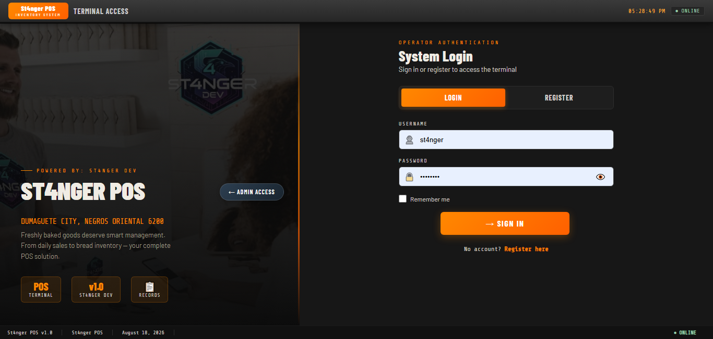
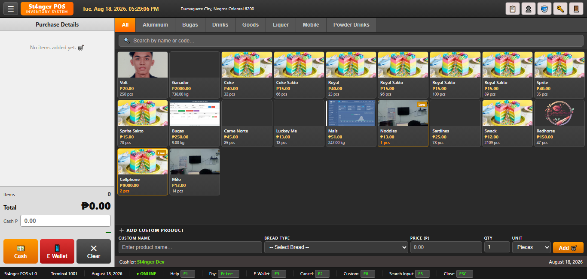
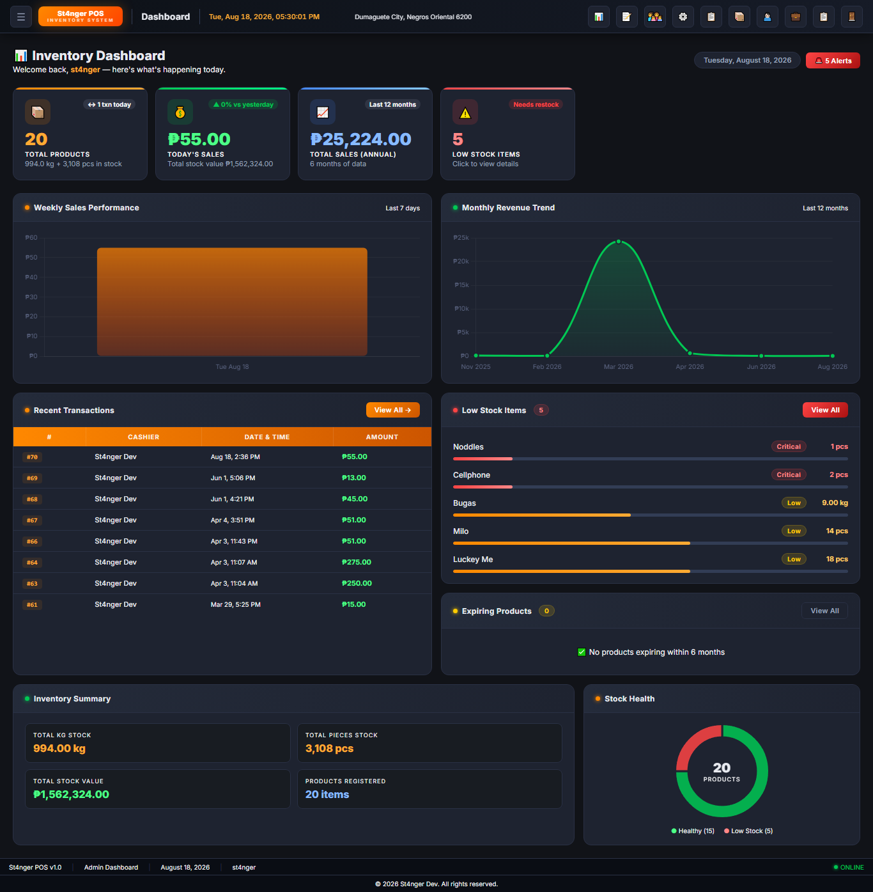
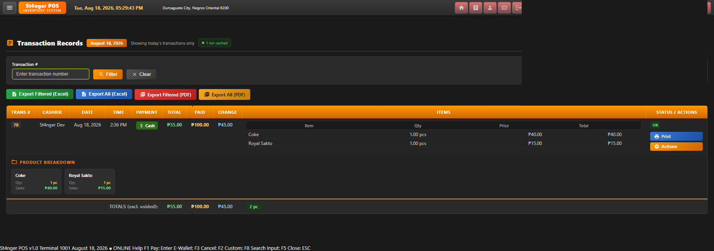
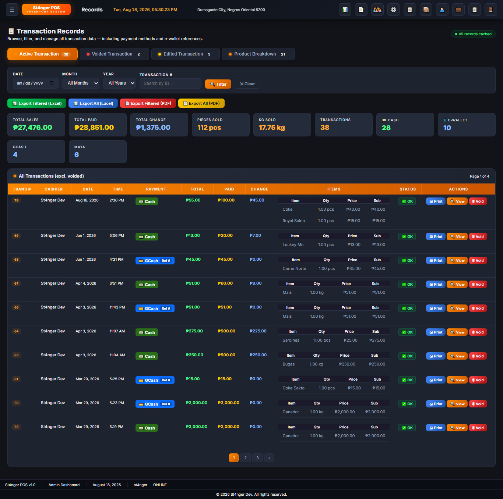

# St4nger POS

**St4nger POS** is a modern, reliable, and user-friendly **Point of Sale (POS) system** designed to streamline daily business operations for retail stores and small to medium-sized enterprises.

The system simplifies essential business processes such as **sales transactions, inventory management, customer tracking, and reporting** through an intuitive and easy-to-use interface.

---

## 📸 Screenshots

### POS Login



### POS Homepage



### Dashboard Management



### Inventory Management



### Products Management



---

## ✨ Features

- 🛒 **Point of Sale**
  - Process sales transactions quickly
  - Add products to the current transaction
  - Calculate totals automatically
  - Manage checkout operations

- 📦 **Inventory Management**
  - Track available products
  - Monitor stock levels
  - Manage product information
  - Keep inventory organized

- 👥 **Customer Management**
  - Store customer information
  - Track customer transactions
  - Maintain organized customer records

- 📊 **Reports**
  - View sales information
  - Monitor business performance
  - Generate useful operational insights

- 🔐 **User Management**
  - Secure system access
  - Manage authorized users
  - Support controlled access to POS functionality

- 💻 **User-Friendly Interface**
  - Clean and intuitive design
  - Easy navigation
  - Designed for everyday retail operations

---

## 🎯 Project Objectives

St4nger POS was developed to:

1. Simplify retail sales transactions.
2. Improve inventory tracking and management.
3. Centralize customer information.
4. Provide useful sales and operational reports.
5. Reduce manual processes in daily store operations.
6. Provide an accessible and easy-to-use POS interface.

---

## 🏪 Intended Users

St4nger POS is suitable for:

- Retail stores
- Small businesses
- Medium-sized businesses
- Convenience stores
- Specialty shops
- Product-based businesses
- Other businesses requiring POS and inventory management

---

## 🛠️ Technologies

The project is designed as a web-based POS application and can be deployed using a local XAMPP environment.

### Development Environment

- **XAMPP**
- **Apache**
- **MySQL**
- **PHP**
- **HTML5**
- **CSS3**
- **JavaScript**

---

## 📂 Project Structure

```text
Store/
│
├── image/
│   └── picture/
│       ├── 1.png
│       ├── 2.png
│       ├── 3.png
│       ├── 4.png
│       └── 5.png
│
├── README.md
├── LICENSE
└── ...